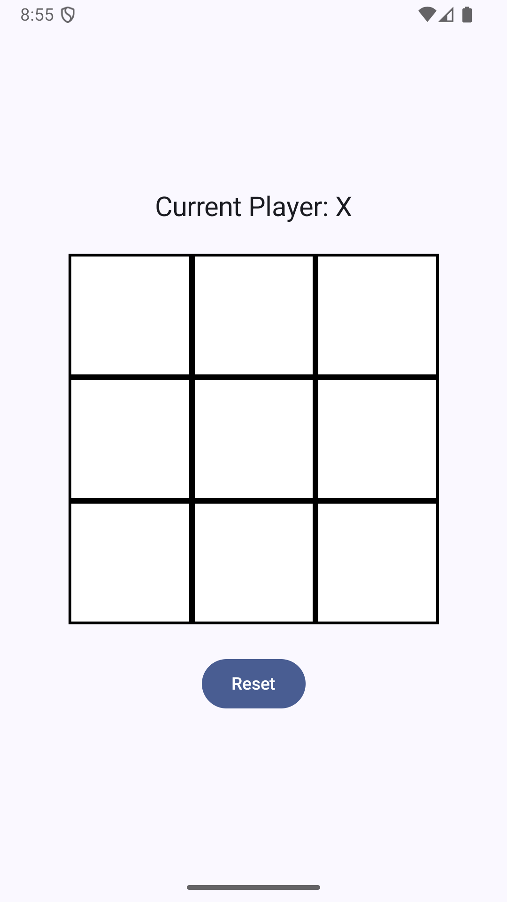
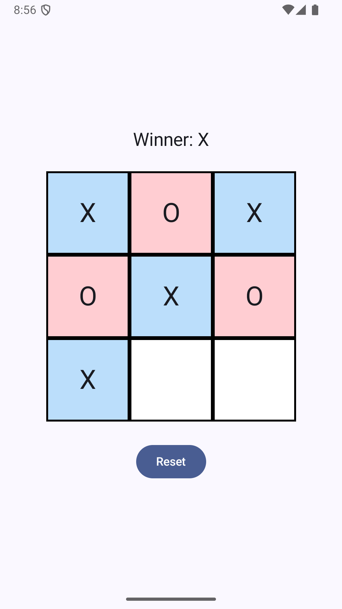
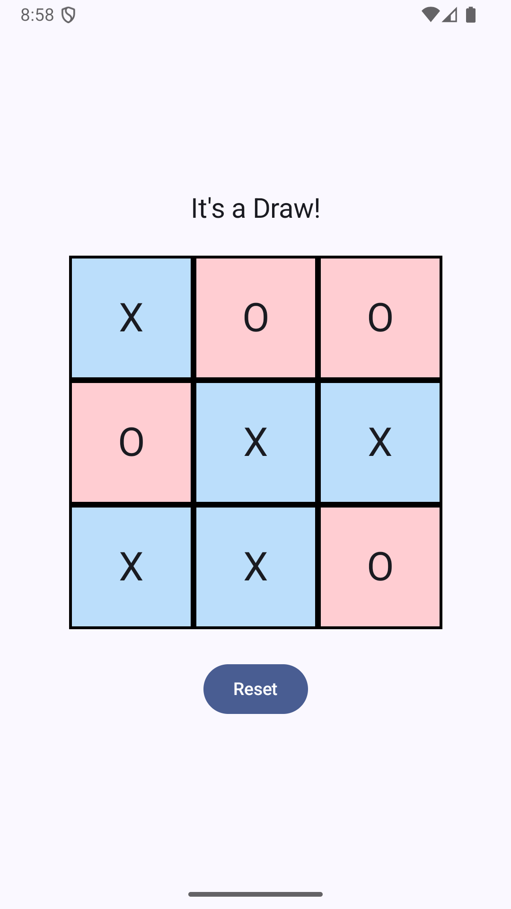

<!DOCTYPE html>
<html lang="en">
<head>
  <meta charset="UTF-8">
  <title>TicTacToe – TDD Driven Kotlin/Compose Game</title>
</head>
<body>

  <h1>🕹️ TicTacToe – TDD Driven Kotlin/Compose Game</h1>

<h2>📖 Project Overview</h2>
  

    This project is a <strong>TicTacToe game</strong> built with <strong>Kotlin, Jetpack Compose, and Hilt DI</strong>.
    It demonstrates <strong>clean architecture principles</strong>, <strong>test-driven development (TDD)</strong>, and <strong>state-driven UI</strong>.
  

<h2>🚀 How to Clone &amp; Run</h2>
  <pre>
# Clone the repository
git clone https://github.com/rtllabs/tdd-tictactoe.git
cd tdd-tictactoe
./gradlew build
./gradlew test
./gradlew connectedAndroidTest
  </pre>

<h2>🎮 How to Play</h2>
  <ol>
    <li>Launch the app on an emulator or device.</li>
    <li>The game starts with <strong>Player X</strong>.</li>
    <li>Tap on any empty cell to place your mark.</li>
    <li>Players alternate turns until one wins or the board fills (draw).</li>
    <li>Use the <strong>Reset</strong> button to start a new game.</li>
  </ol>

<h2>⚙️ Tech Stack</h2>
  <ul>
    <li><strong>Language</strong>: Kotlin</li>
    <li><strong>UI</strong>: Jetpack Compose</li>
    <li><strong>DI</strong>: Hilt</li>
    <li><strong>Architecture</strong>: Clean Architecture + MVVM</li>
    <li><strong>State Management</strong>: StateFlow + sealed <code>GameUiState</code></li>
    <li><strong>Testing</strong>: JUnit + AndroidX Compose UI Test</li>
  </ul>

<h2>✅ TDD Test Coverage</h2>
  <ul>
    <li>Unit Tests: Game logic, win/draw detection, invalid moves.</li>
    <li>ViewModel state emissions.</li>
    <li>UI Tests: Compose board interactions, reset button, win/draw messages.</li>
  </ul>

<h2>🖼️ Screenshots</h2>
  
Sample screens from the game:

  
  
  

<h2>📊 Summary</h2>
  

    This project is both a <strong>learning kata</strong> and a <strong>production-ready scaffold</strong> for modular, testable Android apps.  
    It showcases:
    <ul>
      <li><strong>TDD discipline</strong> (domain logic fully covered).</li>
      <li><strong>Composable UI testing</strong> (asserting text and board updates).</li>
      <li><strong>Hilt DI integration</strong>.</li>
    </ul>
  

</body>
</html>
